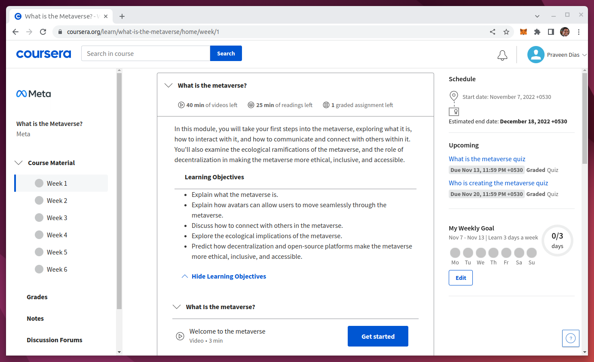
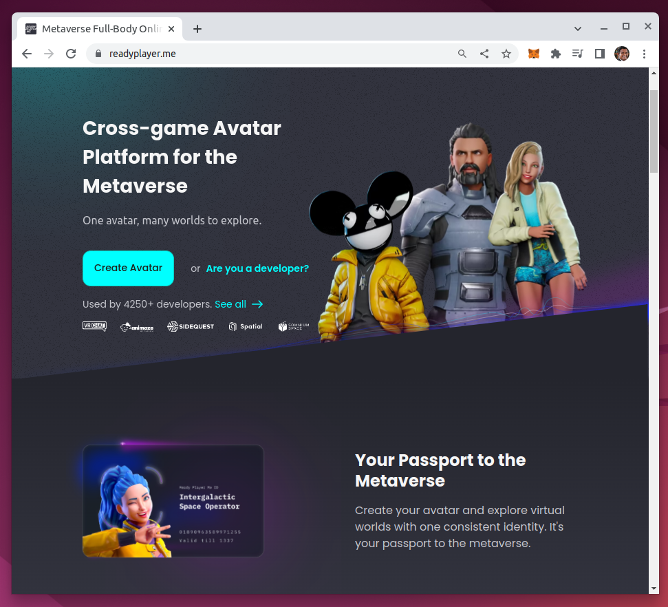
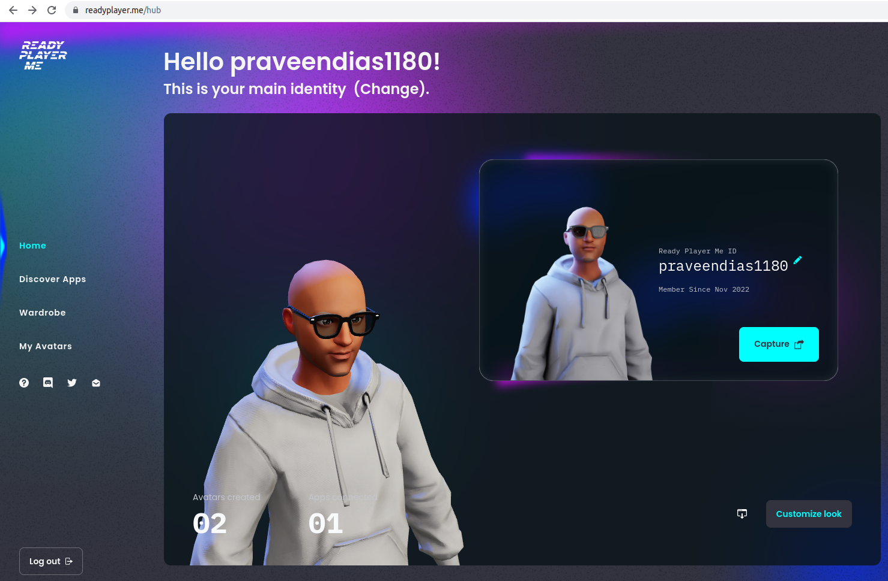
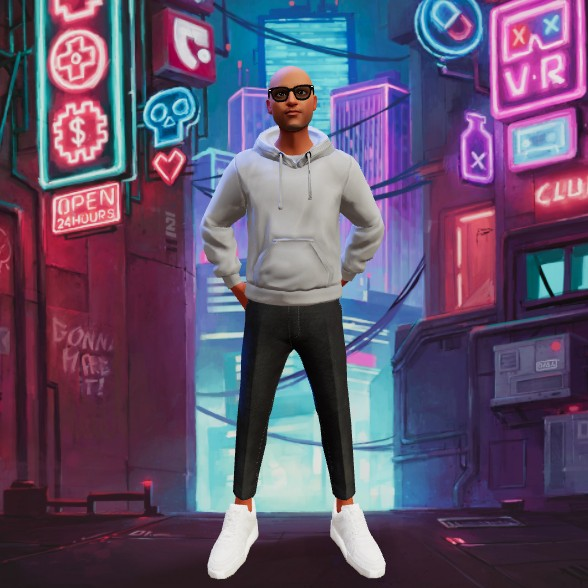

# The Course

https://www.coursera.org/learn/what-is-the-metaverse

# What is Metaverse?

So what is the metaverse? Simply put, it's the next generation of the internet, and it's going to turn today's online experiences into interconnected, immersive digital spaces where you can interact with others no matter where you are physically. What's special about the metaverse is that in many ways it has more in common with our physical world than it does with today's internet.

# Co-presence

We call this co-presence, or that feeling of being physically together even when we're not. You might have gotten a taste of co-presence through online games like Minecraft or World of Warcraft. The metaverse takes the idea of co-presence beyond gaming and applies it to everything.

# Identity

## Avatar :  An avatar is a way that we might express identity

Did you notice how different the avatars were? They were very realistic ones, stylized ones, fantastical ones, even a giant robot. All kinds of avatars will exist in the metaverse. Now, before we get too deep into a discussion about avatars and how they work in the metaverse, let's take a step back and talk about identity. Identity is how you represent yourself. You already have a virtual identity, more than one actually, that you use when you're online. Are you on Twitter? Your handle is your identity. Your email address is another form of identity, just like your LinkedIn profile and your PayPal account. Essentially, identity is how people recognize you in the digital places you inhabit. One way that we express our identities online, probably the most common way, is through our profile pictures. We use them to show people who we are or who we want to be in a specific virtual space. Now, if you're like me, you probably have different profile pictures for different online spaces. You might have a professional, buttoned up headshot that you use for LinkedIn, but your profile pic on Facebook is more casual or fun. Over on Twitch, you might use a stylized version of yourself, while your Instagram features a beautiful shot of you on your last vacation. Essentially, having different profile photos allows us to express ourselves in whatever way we feel is most appropriate for a certain digital space. They're a method of self expression.

# ReadyPlayer

https://readyplayer.me/

## Metaverse Avatar API

Ready Player Me has launched its Avatar API that improve interoperability for cross-game avatars. The aim is to let users take their avatars with them wherever they go in the metaverse.

# Avatar

# Continuity

## Persistance: Continued Existence

When the metaverse is fully realized, you'll be able to seamlessly move from space to space. You remember this is called continuity. But more than just being able to move around, you'll also be able to take things with you, like your avatar. That's interoperability. And it's one of the core attributes that differentiates the metaverse from the internet we know today. 